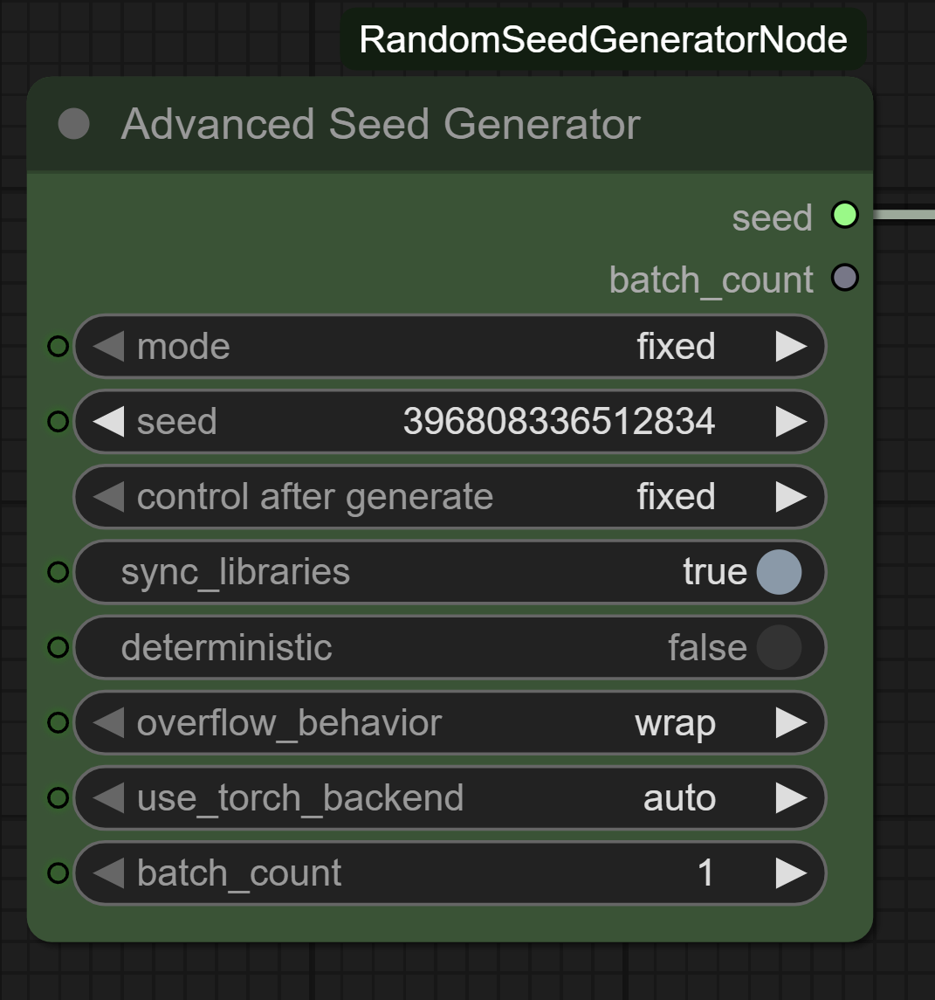

# ComfyUI-RandomSeedGenerator



[](https://opensource.org/licenses/Apache-2.0)
[](https://github.com/comfyanonymous/ComfyUI)
[](https://python.org)

**🎲 Advanced Seed Generator** - A professional-grade custom node for ComfyUI that provides comprehensive seed generation capabilities with multiple modes, state persistence, cross-library synchronization, and enterprise-level reliability features.

## ✨ Features

- **🎯 Multiple Generation Modes**: Fixed, Random, Increment, and Decrement modes for various workflows
- **🔄 State Persistence**: Maintains seed state across executions for increment/decrement modes
- **🔗 Cross-Library Sync**: Synchronizes seeds across Python, NumPy, and PyTorch for consistent results
- **⚡ Performance Optimized**: Intelligent backend selection (Python random vs PyTorch) based on batch size
- **🛡️ Thread-Safe Operations**: Concurrent access protection with threading.RLock()
- **🔧 Configurable Overflow**: Wrap, clamp, or error handling for boundary conditions
- **📊 Batch Generation**: Generate up to 100,000 seeds efficiently in batch mode
- **🎮 CUDA Support**: Full GPU acceleration support with deterministic mode options
- **🐛 Comprehensive Logging**: Configurable debug logging for troubleshooting
- **✅ Input Validation**: Robust error handling and parameter validation

## 🚀 Installation

### Method 1: Manual Installation
1. Navigate to your ComfyUI `custom_nodes` directory
2. Clone this repository:
   ```bash
   git clone https://github.com/Limbicnation/ComfyUI-RandomSeedGenerator.git
   ```
3. Restart ComfyUI
4. The node will appear under `utils` category as "🎲 Advanced Seed Generator"

### Method 2: ComfyUI Manager (Recommended)
1. Install [ComfyUI Manager](https://github.com/ltdrdata/ComfyUI-Manager)
2. Search for "Random Seed Generator" in the manager
3. Install and restart ComfyUI

### Method 3: ComfyUI Registry
```bash
comfy node install randomseedgenerator
```

## 📖 Usage Guide

### Node Parameters

| Parameter | Type | Default | Description |
|-----------|------|---------|-------------|
| **mode** | Dropdown | "fixed" | Generation mode: `fixed`, `increment`, `decrement`, `random` |
| **seed** | Integer | 0 | Base seed value (0 to 18,446,744,073,709,551,615) |
| **sync_libraries** | Boolean | True | Synchronize seed across Python, NumPy, PyTorch |
| **deterministic** | Boolean | False | Enable full deterministic mode (may impact performance) |
| **overflow_behavior** | Dropdown | "wrap" | Overflow handling: `wrap`, `clamp`, `error` |
| **use_torch_backend** | Dropdown | "auto" | Backend selection: `auto`, `random`, `torch` |
| **batch_count** | Integer | 1 | Number of seeds to generate (1-100,000) |

### Generation Modes

#### 🔒 Fixed Mode
Returns the exact seed value you specify. Perfect for reproducible generations.
```
Input: seed=12345 → Output: 12345 (always)
```

#### 🎲 Random Mode  
Generates a new random seed on each execution (0 to 2^64-1).
```
Input: any seed → Output: 4831672946, 9573821047, ... (random)
```

#### ⬆️ Increment Mode
Increments from the last generated seed by 1. State persists across workflow executions.
```
First run: 42 → Second run: 43 → Third run: 44 ...
```

#### ⬇️ Decrement Mode
Decrements from the last generated seed by 1. State persists across workflow executions.
```
First run: 42 → Second run: 41 → Third run: 40 ...
```

### Overflow Behavior Options

- **🔄 Wrap (Default)**: Cycles around boundaries (MAX → MIN, MIN → MAX)
- **🛑 Clamp**: Stops at boundaries (stays at MAX/MIN when limit reached)  
- **❌ Error**: Raises exception when overflow would occur

### Backend Selection

- **🤖 Auto (Recommended)**: Optimal backend selection based on batch size
  - Single seeds: Python random (fastest)
  - Batches ≥100: PyTorch CPU
  - Batches ≥1000: PyTorch GPU (if available)
- **🐍 Random**: Force Python random module (good for small operations)
- **🔥 Torch**: Force PyTorch backend (better for large batches)

## 💡 Usage Examples

### Basic Seed Generation
1. Add "🎲 Advanced Seed Generator" to your workflow
2. Set mode to "random" for exploration or "fixed" for reproducibility
3. Connect the output to any node requiring a seed (KSampler, etc.)

### Batch Exploration Workflow
1. Set `mode` to "increment" 
2. Set `batch_count` to 10
3. Use with batch processors to generate variations systematically

### Professional Reproducibility Setup
1. Set `mode` to "fixed"
2. Enable `sync_libraries` and `deterministic`
3. Document your seed values for exact reproduction

## 🔧 Advanced Configuration

### Environment Variables
```bash
# Set logging level for debugging
export COMFYUI_SEED_LOG_LEVEL=DEBUG  # Options: DEBUG, INFO, WARNING, ERROR
```

### Performance Tuning
- **Small batches (1-99)**: Use "random" backend for minimal overhead
- **Medium batches (100-999)**: Use "auto" for optimal CPU performance  
- **Large batches (1000+)**: Use "auto" with CUDA for GPU acceleration

## 📋 Requirements

- **ComfyUI**: Latest version recommended
- **Python**: 3.8 or higher
- **Dependencies**: 
  - `torch` (PyTorch)
  - `numpy` 
  - `threading` (built-in)
  - `logging` (built-in)

## 🔍 Troubleshooting

### Common Issues

**Node not appearing in menu:**
- Restart ComfyUI completely
- Check console for import errors
- Verify all dependencies are installed

**Increment/Decrement not working:**
- State persists at class level - normal behavior
- Use `reset_state()` method in console if needed
- Check overflow_behavior setting

**Performance issues with large batches:**
- Set backend to "torch" for batches >1000
- Enable GPU if available for CUDA acceleration
- Monitor memory usage with very large batches

### Debug Logging
Enable detailed logging to diagnose issues:
```bash
export COMFYUI_SEED_LOG_LEVEL=DEBUG
# Restart ComfyUI and check console output
```

## 🤝 Contributing

Contributions are welcome! Please:
1. Fork the repository
2. Create a feature branch
3. Add tests for new functionality
4. Submit a pull request

## 📝 License

This project is licensed under the Apache License 2.0 - see the [LICENSE](LICENSE) file for details.

## 🙏 Acknowledgments

- ComfyUI community for the amazing platform
- Contributors and testers
- Enhanced and maintained with Claude Code

---

**⭐ If this node helps your workflow, please consider starring the repository!**

For issues, feature requests, or questions, please visit our [GitHub Issues](https://github.com/Limbicnation/ComfyUI-RandomSeedGenerator/issues) page.
