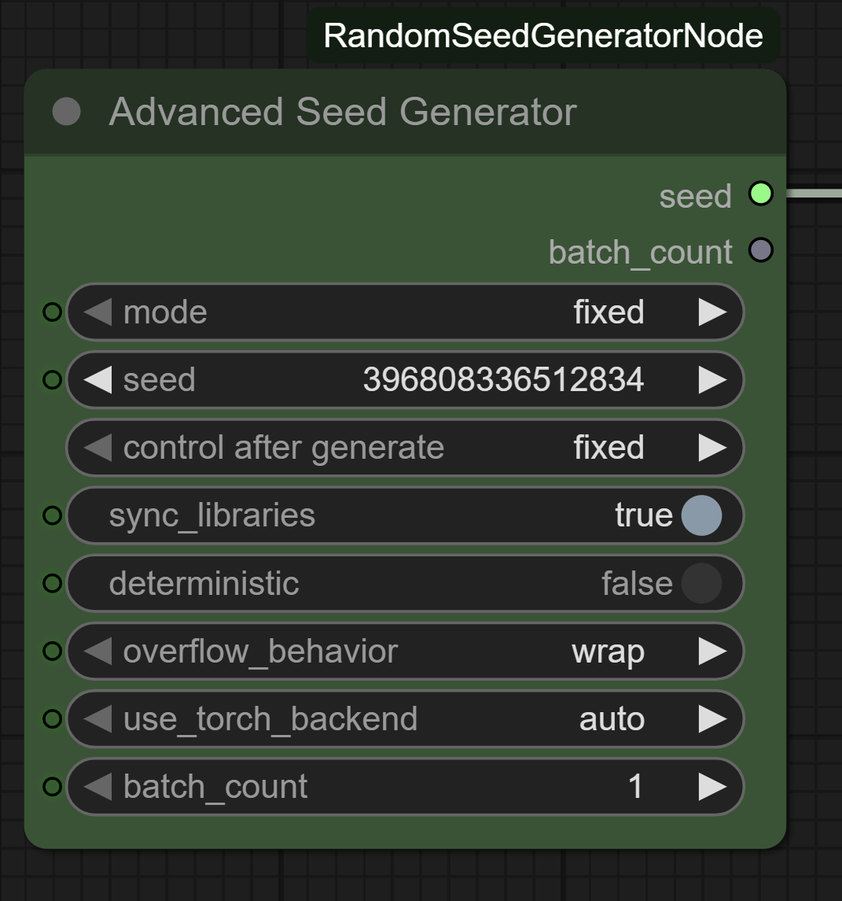

# ComfyUI-RandomSeedGenerator



[](https://opensource.org/licenses/Apache-2.0)
[](https://github.com/comfyanonymous/ComfyUI)
[](https://python.org)

**🎲 Advanced Seed Generator** — a small, focused custom node for ComfyUI that produces seed values in four modes: fixed, random, increment, and decrement. Pure Python standard library, no external dependencies.

## ✨ Features

- **🎯 Four generation modes**: `fixed`, `random`, `increment`, `decrement`
- **🔁 Cross-execution state**: increment/decrement remember the last seed across workflow runs
- **🌐 Full 64-bit range**: seeds span `0` to `2⁶⁴ − 1` (`18,446,744,073,709,551,615`)
- **♾️ Safe wrap-around**: increment past MAX wraps to `0`; decrement past `0` wraps to MAX
- **📦 Zero dependencies**: uses only `random`, `time`, and `logging` from the Python stdlib
- **🧩 Registry-ready**: published to the [ComfyUI Registry](https://registry.comfy.org)

## 🚀 Installation

### Method 1 — Manual

```bash
cd ComfyUI/custom_nodes
git clone https://github.com/Limbicnation/ComfyUI-RandomSeedGenerator.git
```

Restart ComfyUI. The node appears under **utils** as **🎲 Advanced Seed Generator**.

### Method 2 — ComfyUI Manager (recommended)

1. Install [ComfyUI Manager](https://github.com/ltdrdata/ComfyUI-Manager).
2. Search for **Random Seed Generator**.
3. Install and restart ComfyUI.

### Method 3 — ComfyUI Registry

```bash
comfy node install randomseedgenerator
```

## 📖 Usage

### Parameters

| Parameter | Type | Default | Description |
|-----------|------|---------|-------------|
| **mode** | Dropdown | `fixed` | One of `fixed`, `random`, `increment`, `decrement` |
| **seed** | Integer | `0` | Used directly in `fixed` mode; ignored in the others |

### Modes

#### 🔒 Fixed
Returns the exact seed value provided. Use for reproducible generations.

```
seed=12345 → 12345 (always)
```

#### 🎲 Random
Returns a fresh random seed in `[0, 2⁶⁴−1]` on every execution.

```
→ 4831672946…, 9573821047…, …
```

#### ⬆️ Increment
Returns `last_seed + 1`. State persists across workflow runs.

```
run 1: 42 → run 2: 43 → run 3: 44 …
```

#### ⬇️ Decrement
Returns `last_seed − 1`. State persists across workflow runs.

```
run 1: 42 → run 2: 41 → run 3: 40 …
```

### Wrap-around

Increment and decrement wrap at the 64-bit boundary: `MAX → 0` and `0 → MAX`. No configuration; this is always the behavior.

### State scope

The `_last_seed` counter is **class-level** — shared across every instance of the node in the current ComfyUI process. ComfyUI does not surface per-node identity to the executor, so isolated counters per node aren't possible without upstream API changes. If you need independent counters, use `random` mode and seed downstream samplers directly.

## 📋 Requirements

- **ComfyUI**: any current version
- **Python**: 3.9+
- **Dependencies**: none (Python stdlib only)

## 🔍 Troubleshooting

**Node not appearing in the menu**
- Restart ComfyUI completely.
- Check the ComfyUI console for import errors.

**Increment/decrement counter is "wrong"**
- The counter is shared across all instances of this node in the workflow. See *State scope* above.
- To reset to `0`, call `AdvancedSeedGenerator.reset_state()` from the ComfyUI Python console.

## 🤝 Contributing

Pull requests welcome. Please:

1. Fork and create a feature branch.
2. Add tests under `tests/` for new behavior.
3. Run `python -m pytest tests/`.
4. Open a PR.

## 📝 License

Apache License 2.0 — see [LICENSE](LICENSE).

---

**⭐ If this node helps your workflow, please consider starring the repository.**

For issues or feature requests, see [GitHub Issues](https://github.com/Limbicnation/ComfyUI-RandomSeedGenerator/issues).
